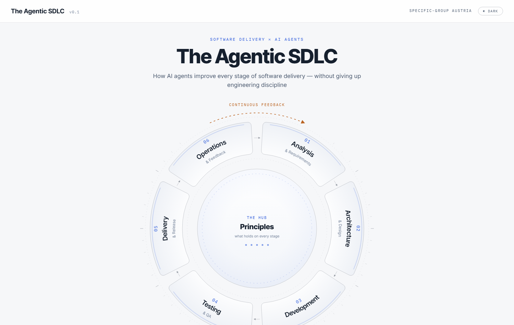

# The Agentic SDLC

> How AI agents improve every stage of software delivery — without giving up engineering discipline.

An interactive mind-map and presentation artifact exploring how AI agents change the software development lifecycle. Built as a single-page app with **no build step** — just open `index.html` in a browser.



## The model

Six SDLC stages arranged as an SVG wheel around a hub of five guiding principles:

1. **Analysis & Requirements**
2. **Architecture & Design**
3. **Development**
4. **Testing & QA**
5. **Delivery & Release**
6. **Operations & Feedback**

Each stage explores four fixed facets — **Opportunities**, **Risks**, **Feed-forward**, and **Guardrails** — with recursive, expandable detail nodes. The hub holds the five engineering disciplines that hold true across every stage in the AI era.

## Themes

A topbar button cycles three visual themes, persisted in `localStorage`:

- **pro** — light, corporate-blue (the presentation default)
- **dark** — instrument-panel look
- **paper** — cozy field-notes, serif type and handwritten annotations

## Running it

No dependencies, no build:

```
# just open the file
index.html
```

Or serve it locally:

```
npx serve .
```

## Project layout

| File | Purpose |
| --- | --- |
| `index.html` | Entry point |
| `data.js` | **The only file edited day-to-day** — all content renders from here |
| `app.js` | Rendering and interaction (Preact + htm) |
| `styles.css` | Theming and layout |
| `vendor/` | Standalone Preact/htm and marked.js |
| `verify.mjs` | Headless render + screenshot of the views |

## Tech

- [Preact](https://preactjs.com/) + [htm](https://github.com/developit/htm) (standalone, no bundler)
- [marked](https://marked.js.org/) for in-node markdown
- Plain SVG for the wheel

---

Specific-Group Austria
